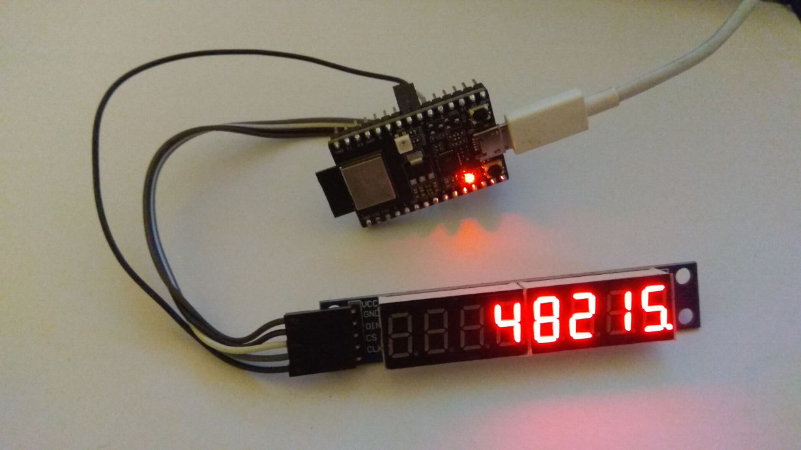

# Cryptoticker for ESP32-C3 RISC-V

This is cryptoticker project for ESP32-C3 RISC-V eng sample. 

For now it shows the price of bitcoin (in USD) using [Bitfinex websocket API](https://docs.bitfinex.com/docs/ws-public).

Its based on [esp-idf](https://github.com/espressif/esp-idf) (tested with v4.3-beta1) and hacked version of [esp-idf-lib](https://github.com/BugerDread/esp-idf-lib/tree/esp32-c3-hack) for ESP32-C3 (just MAX7219 library is used in this project).



## How to build the ticker

### Hardware Required

- ESP32-C3
- MAX7219 8-digit LED display (like https://www.aliexpress.com/item/1005001572247130.html)
- 5 wires

### Hardware setup

| ESP32-C3 GPIO | Display pin |
|:-------------:|:-----------:|
|      +5V      |     Vcc     |
|      GND      |     GND     |
|       7       |     DIN     |
|      10       |     CS      |
|       6       |     CLK     |

### Software setup

- install esp-idf from espressif github - see https://docs.espressif.com/projects/esp-idf/en/latest/esp32/get-started/index.html#installation-step-by-step how to do that (tested with v4.3-beta1) 
- clone https://github.com/BugerDread/esp-idf-lib/tree/esp32-c3-hack
```
git clone --branch esp32-c3-hack https://github.com/BugerDread/esp-idf-lib.git
```
- clone this repository
```
git clone https://github.com/BugerDread/cryptoticker-esp32-c3
```
- open cryptoticker-esp32-c3/CMakeLists.txt and modify following line - the second path needs to point to "components" directory of esp-idf-lib you cloned in 2nd step (see [Readme of the esp-idf-lib](https://github.com/espressif/esp-idf/blob/master/README.md) for details):
```
set(EXTRA_COMPONENT_DIRS $ENV{IDF_PATH}/examples/common_components/protocol_examples_common ~/projects/esp32-c3/esp-idf-lib/components)

for example if you have esp-idf-lib in ~/somepath/esp-idf-lib, change it to:

set(EXTRA_COMPONENT_DIRS $ENV{IDF_PATH}/examples/common_components/protocol_examples_common ~/somepath/esp-idf-lib/components)
```

### Build and Flash

- move into "esp-idf" directory and run following (please note the dot and the space, they are IMPORTANT)
```
. export.sh
```
- move into "cryptoticker-esp32-c3" directory and run following
```
idf.py set-target esp32c2
idf.py menuconfig
```
- in menuconfig go to "Example Connection Configuration"
- make sure "connect using WiFi interface" is selected
- fill in your WiFi SSID and Password
- make sure that "connect using Ethernet interface" and "Obtain IPv6 address" are NOT enabled
- return into main menu and go to "Cryptoticker configuration" - you can set display brightness here (more options maybe in the future)
- return into main menu and go to "Component config" -> "ESP-TLS"
- select "Allow potentially insecure options" and "Skip server certificate verification by default" - this ovecome the need to have valid (updated) bitfinex api certificate in the code
- save the configuration and quit menuconfig
- connect ESP32-C3 to the computer if not connected yet
- buid and flash using following command (replace /dev/ttyUSB0 with your serial port)
```
idf.py -p /dev/ttyUSB0 build flash monitor
```
- wait until build and flash is finished, serial monitor will be started when flashing is finished and your new ticker will boot up (press CTRL + ] to quit the monitor)
- enjoy your new bitcoin ticker :D

